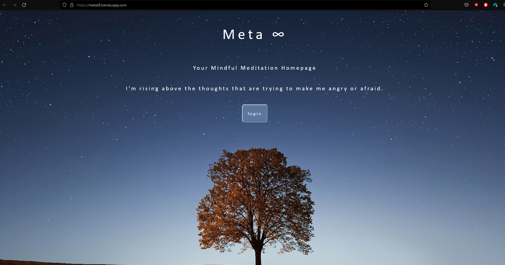

# Metat8
Mindful meditation exploration

[Visit Our Site](https://metat8.herokuapp.com/)

## Description

Our second major project, Metat8 is your mindful meditation homepage. 

The concept for Metat8 allows an individual to record their mood, their daily intention, their thoughts, and feelings. Their vibe. This tool will allow the user to reflect on how they felt on a given day, as well as offer suggestions for music to meet their mood. 

Our second major project provided an excellent hands-on experience that allowed each of us to explore the realms of handlebars, Node, and Express, and of course,javascript.  We also got first hand experience with Insomnia, authentication, data encryption, and databases with mySQL. Further, we deployed our application through Heroku. Visit the link to check it out! 

## Installation

Clone the repo, and run npm install. 

## Usage

When you arrive to the site you will be welcomed with inspirational messages on the home page. Once you click the login button a model will populate in the center of the page to enter your your user login information 

Once logged in, you will be taken to the user dashboard where there will be a calendar displaying the current month and day and a journal entry form where you can record you mood, intentions, thoughts, and feelings.  The entry will then be stored into the user database.  Once submitted a song will be suggested to match your mood.

## Contributors

Created by [@spugety](https://github.com/spugety), [@wookiechoi](https://github.com/wookiechoi/),  [@jesciak](https://github.com/jesciak/), and  [sensational11](https://github.com/sensational11)

## Credits 

https://coding-boot-camp.github.io/full-stack/
https://sequelize.org/api/v6/class/src/model.js~model
https://developer.mozilla.org/en-US/docs/Web/API/Fetch_API/Using_Fetch
https://handlebarsjs.com/guide/
https://insomnia.rest/
https://www.mysql.com/
https://www.w3schools.com/js/js_api_intro.asp
https://www.w3schools.com/jsref/met_element_addeventlistener.asp
https://www.w3schools.com/howto/howto_css_parallax.asp
https://www.w3schools.com/css/css3_flexbox.asp
https://rapidapi.com/Glavier/api/spotify23/
https://www.w3schools.com/jsref/jsref_obj_date.asp

## License

MIT License

Copyright (c) 2022 Trevor Dent

Permission is hereby granted, free of charge, to any person obtaining a copy
of this software and associated documentation files (the "Software"), to deal
in the Software without restriction, including without limitation the rights
to use, copy, modify, merge, publish, distribute, sublicense, and/or sell
copies of the Software, and to permit persons to whom the Software is
furnished to do so, subject to the following conditions:

The above copyright notice and this permission notice shall be included in all
copies or substantial portions of the Software.

THE SOFTWARE IS PROVIDED "AS IS", WITHOUT WARRANTY OF ANY KIND, EXPRESS OR
IMPLIED, INCLUDING BUT NOT LIMITED TO THE WARRANTIES OF MERCHANTABILITY,
FITNESS FOR A PARTICULAR PURPOSE AND NONINFRINGEMENT. IN NO EVENT SHALL THE
AUTHORS OR COPYRIGHT HOLDERS BE LIABLE FOR ANY CLAIM, DAMAGES OR OTHER
LIABILITY, WHETHER IN AN ACTION OF CONTRACT, TORT OR OTHERWISE, ARISING FROM,
OUT OF OR IN CONNECTION WITH THE SOFTWARE OR THE USE OR OTHER DEALINGS IN THE
SOFTWARE.

